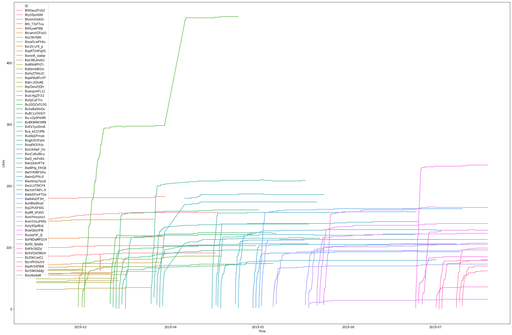
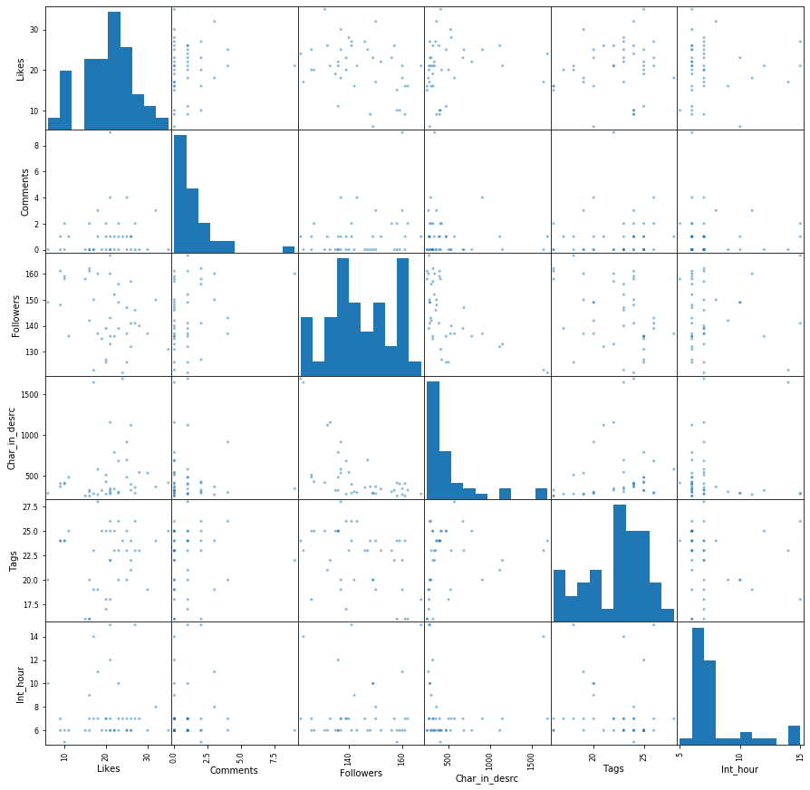
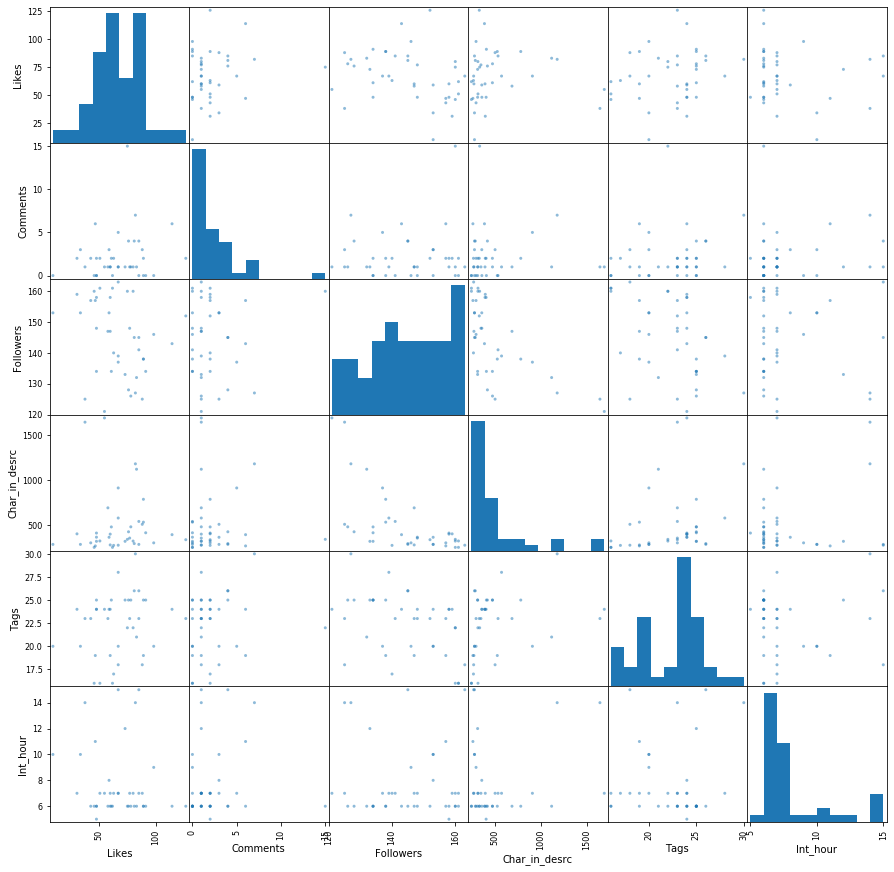
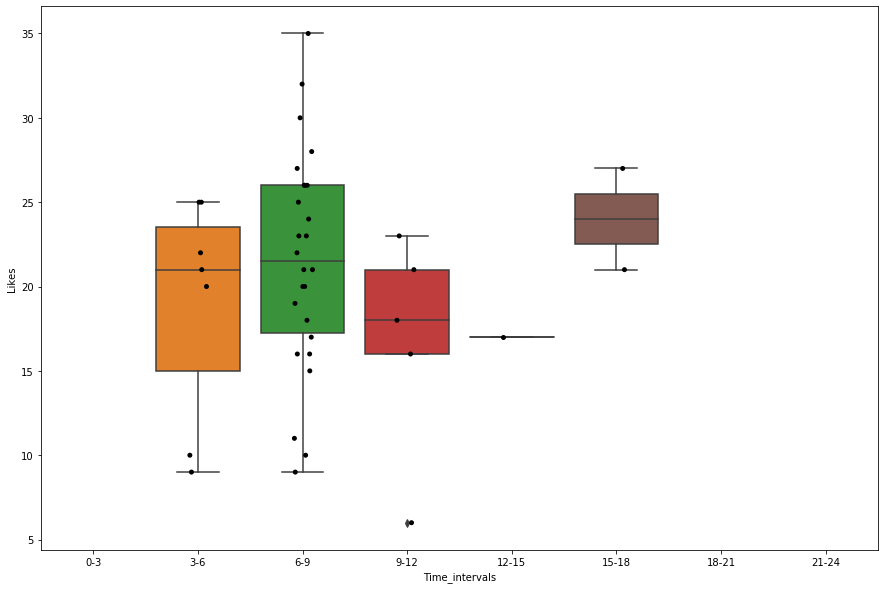
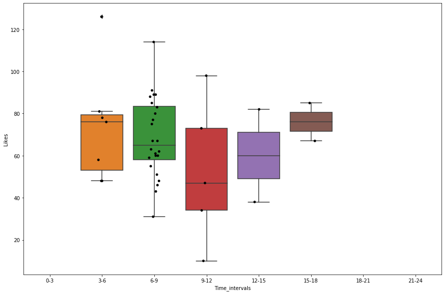
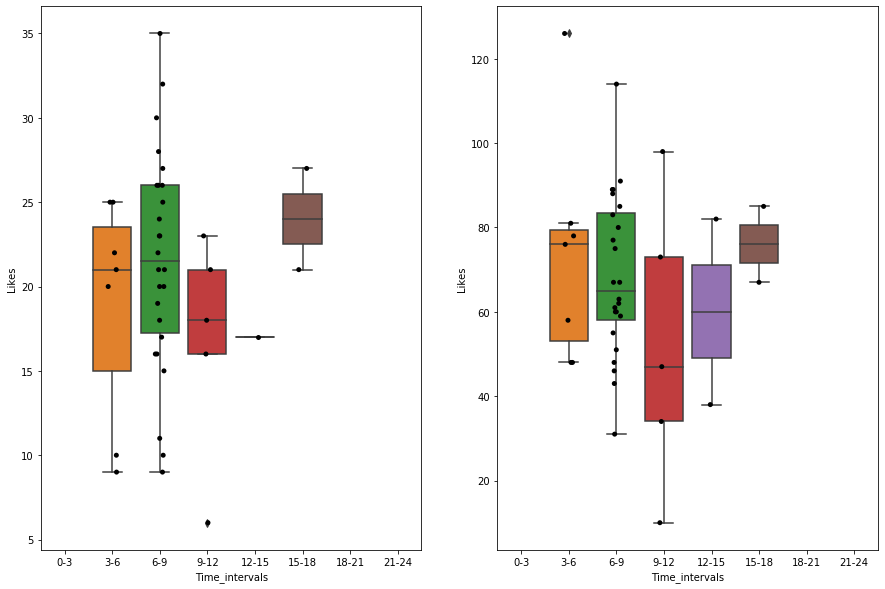
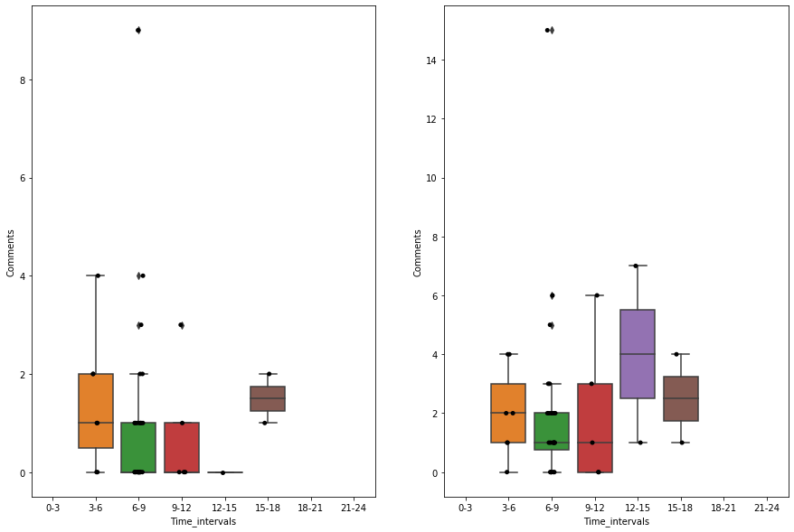

```python
from pandas.plotting import scatter_matrix
import seaborn as sns
import matplotlib.pyplot as plt
from sklearn.pipeline import Pipeline
from load_inst import *
```


```python
instagram = load_instagram() # use this line if you want load whole data
```


```python
get_rows = rows_choose()
inst_h_d = get_rows.transform(instagram) # do not use unless you have updated the data or you want to
                                         # get different timeshifts, it takes a lot of time to compute
with open('inst_h_d', 'wb') as save_pickle:
    pickle.dump(inst_h_d, save_pickle)
```


```python
with open('inst_h_d', 'rb') as tmp_pickle: # line to load data frame with default time shifts
    inst_h_d = pickle.load(tmp_pickle)
```


```python
inst_h_d.loc['1h'].head(5)
```


<div>
<style scoped>
    .dataframe tbody tr th:only-of-type {
        vertical-align: middle;
    }

    .dataframe tbody tr th {
        vertical-align: top;
    }

    .dataframe thead th {
        text-align: right;
    }
</style>
<table border="1" class="dataframe">
  <thead>
    <tr style="text-align: right;">
      <th></th>
      <th>Time</th>
      <th>Likes</th>
      <th>Comments</th>
      <th>Followers</th>
      <th>Char_in_desrc</th>
      <th>Tags</th>
      <th>First_app</th>
    </tr>
    <tr>
      <th>ID</th>
      <th></th>
      <th></th>
      <th></th>
      <th></th>
      <th></th>
      <th></th>
      <th></th>
    </tr>
  </thead>
  <tbody>
    <tr>
      <th>BuanJymFL12</th>
      <td>2019-02-28 07:45:00</td>
      <td>24</td>
      <td>1</td>
      <td>122</td>
      <td>1688</td>
      <td>24</td>
      <td>2019-02-28 06:45:00</td>
    </tr>
    <tr>
      <th>Bud-HgZFl32</th>
      <td>2019-03-01 15:00:00</td>
      <td>17</td>
      <td>0</td>
      <td>123</td>
      <td>1641</td>
      <td>23</td>
      <td>2019-03-01 14:00:00</td>
    </tr>
    <tr>
      <th>BufzjCaF7rs</th>
      <td>2019-03-02 08:05:00</td>
      <td>20</td>
      <td>0</td>
      <td>126</td>
      <td>506</td>
      <td>18</td>
      <td>2019-03-02 07:05:00</td>
    </tr>
    <tr>
      <th>Bu20QZxFG3G</th>
      <td>2019-03-11 06:35:00</td>
      <td>25</td>
      <td>1</td>
      <td>126</td>
      <td>478</td>
      <td>25</td>
      <td>2019-03-11 05:35:00</td>
    </tr>
    <tr>
      <th>Bu5aBa9lnQv</th>
      <td>2019-03-12 06:45:00</td>
      <td>20</td>
      <td>2</td>
      <td>127</td>
      <td>423</td>
      <td>25</td>
      <td>2019-03-12 05:45:00</td>
    </tr>
  </tbody>
</table>
</div>


```python
dividing_point = range(0,25,3)
# default pipeline, it adds two columns - hours of first appereance as integers (it first round
# that time to full hours) and intervals of the time of first appereance
inst_h_d_pipe = Pipeline([('hours_to_int', get_hours()),
                          ('hours_intervals', hours_interval(dividing_points=dividing_point))])
inst_h_d_to_use = inst_h_d_pipe.fit_transform(inst_h_d)
inst_h_d_to_use.loc['1h'].head(5)
```

    h:\Anaconda3\lib\site-packages\pandas\core\indexing.py:190: SettingWithCopyWarning: 
    A value is trying to be set on a copy of a slice from a DataFrame
    
    See the caveats in the documentation: http://pandas.pydata.org/pandas-docs/stable/indexing.html#indexing-view-versus-copy
      self._setitem_with_indexer(indexer, value)
    


<div>
<style scoped>
    .dataframe tbody tr th:only-of-type {
        vertical-align: middle;
    }

    .dataframe tbody tr th {
        vertical-align: top;
    }

    .dataframe thead th {
        text-align: right;
    }
</style>
<table border="1" class="dataframe">
  <thead>
    <tr style="text-align: right;">
      <th></th>
      <th>Time</th>
      <th>Likes</th>
      <th>Comments</th>
      <th>Followers</th>
      <th>Char_in_desrc</th>
      <th>Tags</th>
      <th>First_app</th>
      <th>Int_hour</th>
      <th>Time_intervals</th>
    </tr>
    <tr>
      <th>ID</th>
      <th></th>
      <th></th>
      <th></th>
      <th></th>
      <th></th>
      <th></th>
      <th></th>
      <th></th>
      <th></th>
    </tr>
  </thead>
  <tbody>
    <tr>
      <th>BuanJymFL12</th>
      <td>2019-02-28 07:45:00</td>
      <td>24</td>
      <td>1</td>
      <td>122</td>
      <td>1688</td>
      <td>24</td>
      <td>2019-02-28 06:45:00</td>
      <td>7</td>
      <td>6-9</td>
    </tr>
    <tr>
      <th>Bud-HgZFl32</th>
      <td>2019-03-01 15:00:00</td>
      <td>17</td>
      <td>0</td>
      <td>123</td>
      <td>1641</td>
      <td>23</td>
      <td>2019-03-01 14:00:00</td>
      <td>14</td>
      <td>12-15</td>
    </tr>
    <tr>
      <th>BufzjCaF7rs</th>
      <td>2019-03-02 08:05:00</td>
      <td>20</td>
      <td>0</td>
      <td>126</td>
      <td>506</td>
      <td>18</td>
      <td>2019-03-02 07:05:00</td>
      <td>7</td>
      <td>6-9</td>
    </tr>
    <tr>
      <th>Bu20QZxFG3G</th>
      <td>2019-03-11 06:35:00</td>
      <td>25</td>
      <td>1</td>
      <td>126</td>
      <td>478</td>
      <td>25</td>
      <td>2019-03-11 05:35:00</td>
      <td>6</td>
      <td>3-6</td>
    </tr>
    <tr>
      <th>Bu5aBa9lnQv</th>
      <td>2019-03-12 06:45:00</td>
      <td>20</td>
      <td>2</td>
      <td>127</td>
      <td>423</td>
      <td>25</td>
      <td>2019-03-12 05:45:00</td>
      <td>6</td>
      <td>3-6</td>
    </tr>
  </tbody>
</table>
</div>


```python
plt.figure(figsize=(30, 20))
sns.lineplot(data=instagram, x='Time', y='Likes', hue='ID');
```

    h:\Anaconda3\lib\site-packages\pandas\plotting\_converter.py:129: FutureWarning: Using an implicitly registered datetime converter for a matplotlib plotting method. The converter was registered by pandas on import. Future versions of pandas will require you to explicitly register matplotlib converters.
    
    To register the converters:
    	>>> from pandas.plotting import register_matplotlib_converters
    	>>> register_matplotlib_converters()
      warnings.warn(msg, FutureWarning)
    h:\Anaconda3\lib\site-packages\IPython\core\events.py:88: UserWarning: Creating legend with loc="best" can be slow with large amounts of data.
      func(*args, **kwargs)
    h:\Anaconda3\lib\site-packages\IPython\core\pylabtools.py:128: UserWarning: Creating legend with loc="best" can be slow with large amounts of data.
      fig.canvas.print_figure(bytes_io, **kw)
    





```python
scatter_matrix(inst_h_d_to_use.loc['1h'], figsize=(15, 15));
```





```python
scatter_matrix(inst_h_d_to_use.loc['1d'], figsize=(15, 15));
```





```python
my_order = create_time_intervals(dividing_point)
```


```python
plt.figure(figsize=(15,10))
sns.boxplot(x="Time_intervals", y="Likes", data=inst_h_d_to_use.loc['1h'], order=my_order)
sns.stripplot(x="Time_intervals", y="Likes", data=inst_h_d_to_use.loc['1h'], jitter=True,
              color='black', order=my_order);
```





```python
plt.figure(figsize=(15,10))
sns.boxplot(x="Time_intervals", y="Likes", data=inst_h_d_to_use.loc['1d'], order=my_order)
sns.stripplot(x="Time_intervals", y="Likes", data=inst_h_d_to_use.loc['1d'], jitter=True,
              color='black', order=my_order);
```





```python
f, axes = plt.subplots(1, 2, figsize=(15,10))
sns.boxplot(x="Time_intervals", y="Likes", data=inst_h_d_to_use.loc['1h'], ax=axes[0],order=my_order)
sns.stripplot(x="Time_intervals", y="Likes", data=inst_h_d_to_use.loc['1h'], jitter=True,
              color='black', order=my_order, ax=axes[0]);
sns.boxplot(x="Time_intervals", y="Likes", data=inst_h_d_to_use.loc['1d'], ax=axes[1], order=my_order)
sns.stripplot(x="Time_intervals", y="Likes", data=inst_h_d_to_use.loc['1d'], jitter=True,
              color='black', order=my_order, ax=axes[1]);
```





```python
f, axes = plt.subplots(1, 2, figsize=(15,10))
sns.boxplot(x="Time_intervals", y="Comments", data=inst_h_d_to_use.loc['1h'], ax=axes[0],
            order=my_order)
sns.stripplot(x="Time_intervals", y="Comments", data=inst_h_d_to_use.loc['1h'], jitter=True,
              color='black', order=my_order, ax=axes[0]);
sns.boxplot(x="Time_intervals", y="Comments", data=inst_h_d_to_use.loc['1d'], ax=axes[1],
            order=my_order)
sns.stripplot(x="Time_intervals", y="Comments", data=inst_h_d_to_use.loc['1d'], jitter=True,
              color='black', order=my_order, ax=axes[1]);
```





```python

```


```python

```
